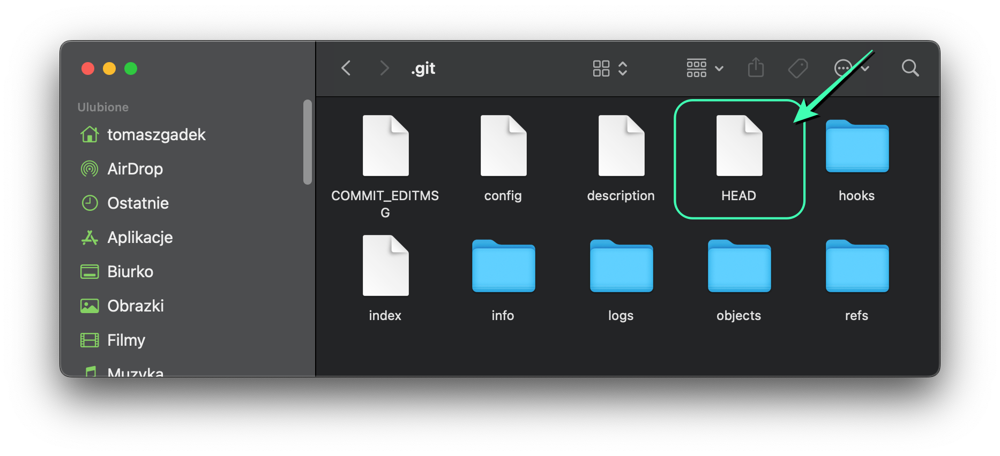

# Git tutorial

_Kolekcja poleceń systemu kontroli wersji Git. Notatki powstały na podstawie książki..._

> **Git i GitHub. Kontrola wersji, zarządzanie projektami i zasady pracy zespołowej** 
> 
> ~Mariot Tsitoara


## Git, polecenia

Inicjowanie repozytorium / bazy danych. Utworzony zostanie plik **.git**. [Inicjalizuje gita](./git/git-init.sh).

```git
git init
```

---

Wewnątrz katalogu **.git** znajduje się plik **HEAD**. Wskazuje gałąź, na której aktualnie pracuje użytkownik.



---

[Klonowanie](./git/git-clone.sh). Kopiuje całą historię wraz z migawkami.

```git
git clone
```

---

Sprawdza stan plików.

```git
git status
```

Polecenie [git status](./git/git-status.sh) śledzi tylko pliki dodane do przechowalni (czyli edytowane pliki, które 
nie mają być uwzględniane w migawce).

> Git przechowuje dane w nietypowy sposób, traktując je jak 
serię migawek (_ang. snapshots_) wszystkich plików, które są 
dodane do poczekalni (_ang. staging area_). Za każdym razem, gdy 
tworzysz **commit**, Git tworzy obraz przedstawiający aktualny stan 
wszystkich plików i zapisuje referencję do tej migawki.

---

[Umieszcza plik w przechowalni / poczekalni](./git/git-add.sh) (_ang. staging area_).

```git
git add README.md
```

---

Usuwanie pliku z przechowalni.

```git
git rm --cached README.md
```

> Usuwa plik z przechowalni (ang. _staging area_), ale nie usuwa go z lokalnego systemu plików.
Oznacza to, że plik przestaje być śledzony przez Git (usunięty z poczekalni), ale fizycznie
nadal istnieje w katalogu roboczym. Po tej operacji zmiany w pliku nie zostaną uwzględnione w
kolejnych commitach, a plik pozostanie na dysku.

---

Tworzenie [migawki](./git/git-commit.sh) aktualnego stanu projektu.

```git
git commit
```

---

Służy do ignorowania plików.
```git
.gitignore
```

> Plik **.gitignore** służy do określenia plików i katalogów, które 
mają być ignorowane przez system kontroli wersji Git. Oznacza to, że 
pliki wymienione w **.gitignore** nie zostaną dodane do przechowalni 
(ang. _staging area_) i nie będą śledzone ani zapisywane w repozytorium.

---

[Rejestr commitów](./git/git-log.sh). Przedstawia listę wszystkich migawek zatwierdzonych przez użytkownika.
```git
git log
```

---

Zapoznanie się ze zmianami wprowadzonymi do projektu. [Szczegóły konkretnego commita](./git/git-show.sh).
```git
git show 9f180aa
```

---

Sprawdza, czy plik w aktualnym stanie różni się od ostatniego commita. 
[Porównuje zmiany](./git/git-diff.sh) z katalogiem roboczym.
```git
git diff TODO.txt
```

---

[Sprawdza zmiany](./git/git-diff-staged.sh) wprowadzone do plików znajdujących się w przechowalni.
```git
git diff --staged
```

---

[Poruszanie / przemieszczanie się po wersjach](./git/git-checkout.sh). Powrót do swojej wersji: `git checkout master`.
```git
git checkout 9f180aa
```

---

[Cofanie commita](./git/git-revert.sh).
```git
git revert 5f57824
git revert [nazwa commita]
```

---

[Lista migawek w jednej linii](./git/git-log-oneline.sh).
```git
git log --oneline
```

---

[Edytowanie commita](./git/git-commit-amend.sh) (pojawi się edytor). To nie jest do końca **edycja**. Tak 
naprawdę jest to tworzenie nowego commita i zastępowanie. Bardziej trafna nazwa 
tej operacji to **poprawianie**.
```git
git commit --amend
```

---

[Wycofywanie pliku](./git/git-reset.sh) **README.md** z przechowalni.
```git
git reset HEAD README.md
```

---

[Usuwanie poprzedniego commita](./git/git-reset-soft.sh) (~1 - to poprzedni commit).
```git
git reset --soft HEAD~1
```

---

[Dodanie odnośnika do nowo utworzonego repozytorium](./git/git-remote.sh):
* **git remote** to zdalne repozytorium.
* **origin** to umowna nazwa. Można ją zmienić. Zaleca się **origin**.

```git
git remote add origin https://...
```

---

[Wypchnięcie danych na serwer](./git/git-push.sh):
* **origin** to nazwa repozytorium zdalnego.
* **master** to nazwa gałęzi.

```git
git push origin master
```

---

[Ustawienia parametrów](./git/git-config.sh) Git'a.
```git
git config --local user.name "John Doe"
git config --global user.name "John Doe"
```

---

Aby połączyć zgłoszenia z commitami można umiescić w stopce: **#nazwa(numer)-zgloszenia**. Commit może składać się z:
+ Tytułu,
+ Rozwinięcia,
+ Stopki.

---

[Tworzenie gałęzi](./git/git-branch.sh).
```
git branch <nazwa>
```

---

[Tworzy odwołanie do ostatniego **commita**](./git/git-branch-last.sh) bieżącej gałęzi.
```
git branch develop
```

---

[Lista gałęzi](./git/git-branch-local.sh).
```
git branch
```
